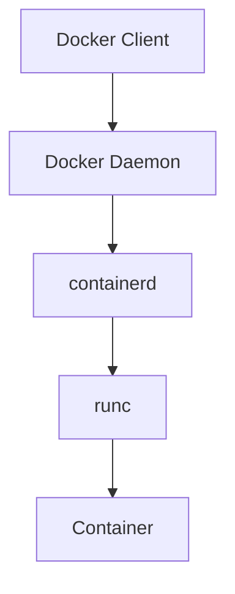

# Contributing to Docker Interview Questions

Thank you for your interest in contributing to this repository! This guide will help you understand how to contribute effectively.

## Table of Contents

- [How to Contribute](#how-to-contribute)
- [Contribution Guidelines](#contribution-guidelines)
- [Question Format](#question-format)
- [Code Examples](#code-examples)
- [Diagrams](#diagrams)
- [Review Process](#review-process)

## How to Contribute

### 1. Fork the Repository
```bash
git clone https://github.com/your-username/docker-interview-questions.git
cd docker-interview-questions
```

### 2. Create a Branch
```bash
git checkout -b feature/new-docker-questions
```

### 3. Make Your Changes
- Add new questions and answers
- Improve existing content
- Fix typos or errors
- Add code examples
- Create diagrams

### 4. Commit Your Changes
```bash
git add .
git commit -m "Add new Docker security questions"
```

### 5. Push and Create Pull Request
```bash
git push origin feature/new-docker-questions
```

## Contribution Guidelines

### Content Quality
- **Accuracy**: Ensure all information is technically accurate
- **Clarity**: Write clear, concise explanations
- **Completeness**: Provide comprehensive answers
- **Examples**: Include practical code examples
- **Diagrams**: Add visual representations where helpful

### Question Categories
We welcome contributions in these areas:
- Basic Docker concepts
- Docker architecture
- Container lifecycle
- Docker images
- Docker networking
- Docker storage
- Docker Compose
- Docker security
- Production deployment
- Troubleshooting
- Advanced topics

### Difficulty Levels
- **Beginner**: Basic concepts and commands
- **Intermediate**: Architecture and configuration
- **Advanced**: Security, performance, and troubleshooting
- **Expert**: Complex scenarios and best practices

## Question Format

### Standard Question Structure
```markdown
## X. [Question Title]

### Question:
[Clear, interview-style question]

### Answer:
[Comprehensive explanation with technical details]

### Code Example:
```bash
# Practical command or configuration
docker run -d nginx
```

### Diagram:
[Visual representation if applicable]

### Follow-up Questions:
- [Related topic 1]
- [Related topic 2]
```

### Example Question
```markdown
## 1. What is Docker and how does it differ from Virtual Machines?

### Question:
Explain Docker and compare it with traditional virtual machines.

### Answer:
Docker is a containerization platform that packages applications and dependencies into lightweight, portable containers. Unlike VMs, Docker containers share the host OS kernel and run as isolated processes.

### Key Differences:
| Aspect | Docker | Virtual Machines |
|--------|--------|------------------|
| Resource Usage | Lightweight | Heavy |
| Startup Time | Seconds | Minutes |
| Isolation | Process-level | Hardware-level |

### Code Example:
```bash
# Docker container
docker run -d nginx

# VM would require full OS installation
```

### Follow-up Questions:
- How does Docker achieve isolation?
- What are the security implications?
```

## 💻 Code Examples

### Code Quality Standards
- **Syntax**: Use correct syntax and formatting
- **Comments**: Add explanatory comments
- **Best Practices**: Follow Docker best practices
- **Security**: Include security considerations
- **Testing**: Provide testable examples

### Code Example Format
```bash
# Good: Clear command with explanation
docker run -d --name web -p 80:80 nginx

# Bad: Unclear or incomplete command
docker run nginx
```

### Configuration Examples
```yaml
# docker-compose.yml example
version: '3.8'
services:
  web:
    image: nginx
    ports:
      - "80:80"
```

## Diagrams

### Diagram Guidelines
- **Clarity**: Use clear, readable diagrams
- **Accuracy**: Ensure technical accuracy
- **Format**: Use text-based diagrams or Mermaid
- **Context**: Provide context and explanations

### Text-based Diagrams
```
┌─────────────────┐    ┌─────────────────┐
│   Docker CLI    │    │   API Client    │
└─────────┬───────┘    └─────────┬───────┘
          │                      │
          └──────────┬───────────┘
                     │
          ┌──────────▼───────┐
          │  Docker Daemon   │
          └──────────────────┘
```

### Mermaid Diagrams


## Review Process

### What We Look For
- **Technical Accuracy**: Correct information
- **Completeness**: Comprehensive coverage
- **Clarity**: Easy to understand
- **Examples**: Practical demonstrations
- **Format**: Consistent structure

### Review Checklist
- [ ] Question is clear and specific
- [ ] Answer is technically accurate
- [ ] Code examples work correctly
- [ ] Diagrams are clear and accurate
- [ ] Follow-up questions are relevant
- [ ] Content follows repository format

## Getting Started

### First Contribution
1. **Start Small**: Fix typos or improve existing content
2. **Read Existing Content**: Understand the format and style
3. **Ask Questions**: Use GitHub issues for clarification
4. **Be Patient**: Reviews may take time

### Suggested First Contributions
- Fix typos or grammatical errors
- Add missing code examples
- Improve existing explanations
- Add follow-up questions
- Create diagrams for complex concepts

## Resources

### Docker Documentation
- [Docker Official Documentation](https://docs.docker.com/)
- [Docker Best Practices](https://docs.docker.com/develop/dev-best-practices/)
- [Docker Security](https://docs.docker.com/engine/security/)

### Learning Resources
- [Docker Tutorials](https://docs.docker.com/get-started/)
- [Docker Compose](https://docs.docker.com/compose/)
- [Docker Security](https://docs.docker.com/engine/security/)

## Reporting Issues

### Bug Reports
When reporting issues, please include:
- **Description**: Clear description of the issue
- **Steps to Reproduce**: How to reproduce the problem
- **Expected Behavior**: What should happen
- **Actual Behavior**: What actually happens
- **Environment**: Docker version, OS, etc.

### Feature Requests
For new features, please include:
- **Description**: What you'd like to see
- **Use Case**: Why this would be helpful
- **Examples**: How it would work
- **Alternatives**: Other solutions considered

## License

By contributing to this repository, you agree that your contributions will be licensed under the MIT License.

## Recognition

Contributors will be recognized in:
- README.md contributors section
- Individual question credits
- Release notes

## 📞 Contact

- **GitHub Issues**: For questions and discussions
- **Pull Requests**: For code and content contributions
- **Discussions**: For general questions and ideas

Thank you for contributing to make this resource better for everyone! 🐳
